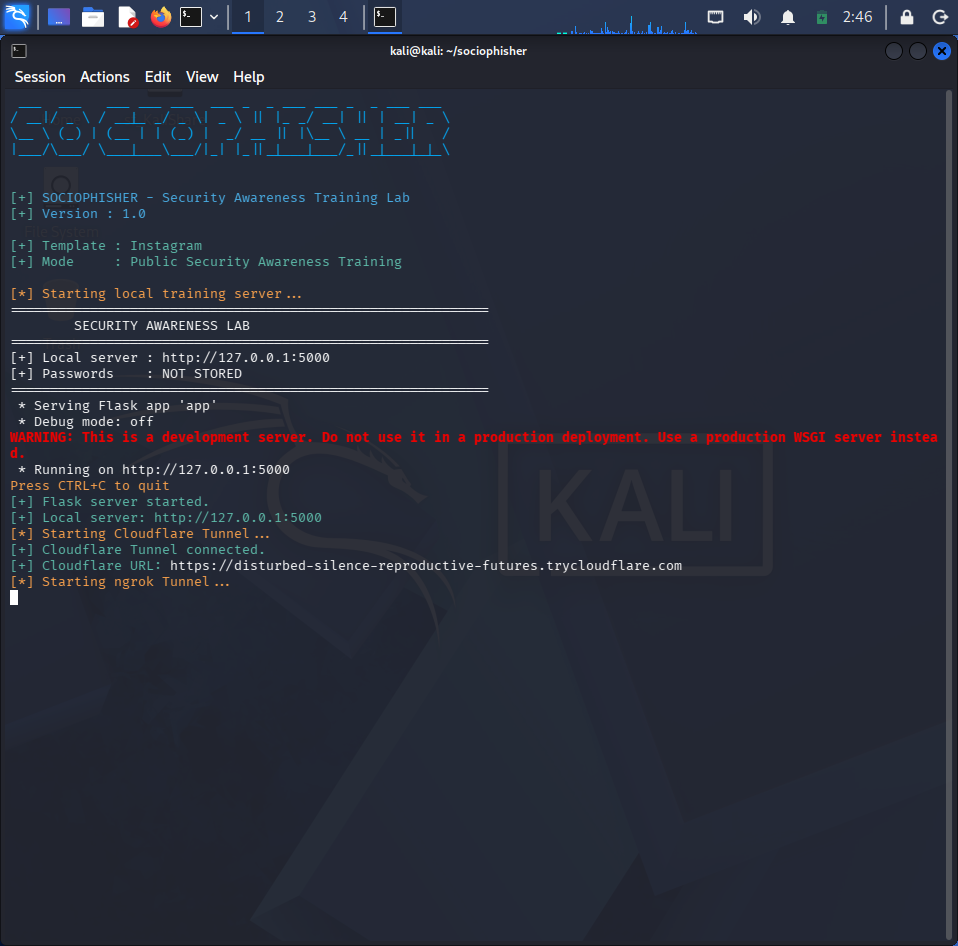
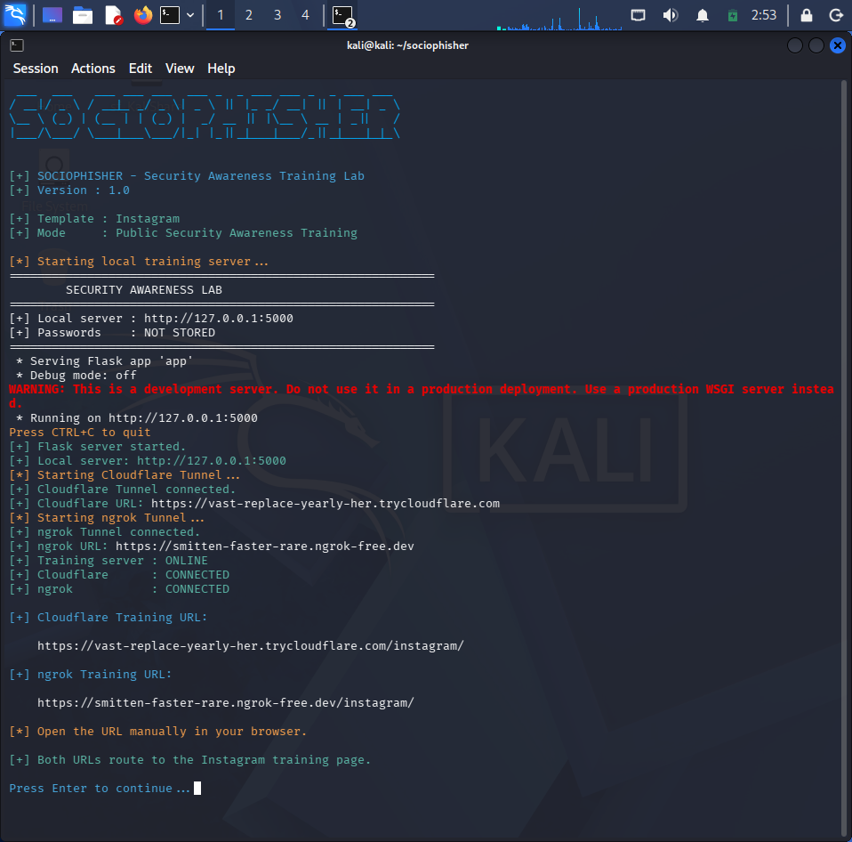
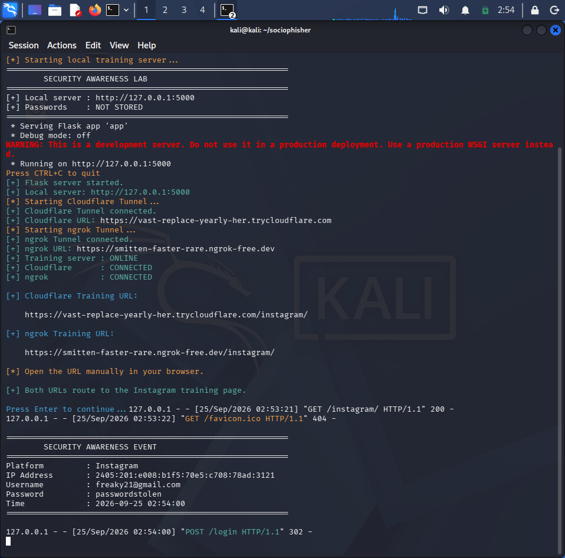

 <h1>🛡️ SOCIOPHISHER</h1>

<p align="center">
  <b>Security Awareness & Social Engineering Training Lab</b>
</p>

<p align="center">
  
  
  
  
  
</p>

<p align="center">
  <a href="#features">Features</a> •
  <a href="#installation">Installation</a> •
  <a href="#usage">Usage</a> •
  <a href="#screenshots">Screenshots</a> •
  <a href="#security">Security</a>
</p>

---

## 📖 About

**Sociophisher** is a security-awareness training laboratory designed to demonstrate how social-engineering and phishing-style interfaces can be used during authorized security training.

The project provides realistic-looking training interfaces for commonly targeted services while intentionally avoiding the storage of real passwords.

The goal is to help students and security teams understand:

- How phishing pages can look convincing
- How users may interact with suspicious login pages
- How authentication attempts can be detected
- How security-awareness exercises can be performed safely
- How security teams can analyze simulated events

> ⚠️ **This project is intended for authorized security-awareness training, education, and laboratory environments only.**

---

## ✨ Features

- 🎯 Interactive security-awareness training pages
- 📱 Multiple social-media-style templates
- 🔐 Password values are **never stored**
- 📝 Simulated login-attempt detection
- 🖥️ Flask-based local training server
- 🐧 Designed for Kali Linux
- 🌐 Supports authorized tunnel-based demonstrations
- 📊 Simple CLI-based launcher
- 🔄 Automatic routing between training templates
- 🧪 Suitable for cybersecurity learning labs
- 🛡️ Designed with privacy and safe-training principles

---

## 🎨 Training Templates

Sociophisher currently includes training interfaces for:

| # | Template | Route |
|---|---|---|
| 01 | Instagram | `/instagram/` |
| 02 | Facebook | `/facebook/` |
| 03 | LinkedIn | `/linkedin/` |
| 04 | Gmail / Google | `/gmail/` |

These pages are intended to demonstrate **social-engineering awareness**, not to collect real credentials.

---

## 🛠️ Technology Stack

```text
Python
Flask
HTML
CSS
JavaScript
Kali Linux
Cloudflare Tunnel
ngrok
```

---

## 📂 Project Structure

```text
SOCIOPHISHER/
│
├── app.py
├── sociophisher.py
│
├── templates/
│   ├── facebook/
│   │   └── index.html
│   │
│   ├── instagram/
│   │   └── index.html
│   │
│   ├── linkedin/
│   │   └── index.html
│   │
│   ├── google1/
│   │   └── index.html
│   │
│   ├── google2/
│   │   └── index.html
│   │
│   └── login.html
│
├── .github/
│   └── screenshots/
│       ├── Screenshot 2026-09-25 122359.png
│       ├── first.png
│       ├── interface.png
│       ├── last.png
│       └── third.png
│
├── venv/
│
└── README.md
```

---

## ⚙️ Installation

### 1. Clone the repository

```bash
git clone git@github.com:sujeth-x/SOCIOPHISHER.git
```

### 2. Enter the project

```bash
cd SOCIOPHISHER
```

### 3. Create a virtual environment

```bash
python3 -m venv venv
```

### 4. Activate the virtual environment

```bash
source venv/bin/activate
```

### 5. Install Flask

```bash
pip install flask
```

---

## 🚀 Usage

Start Sociophisher using:

```bash
python3 sociophisher.py
```

The launcher starts the Flask application and provides the available training routes.

The local training server runs on:

```text
http://127.0.0.1:5000
```

You can then access the individual training pages:

```text
Instagram
http://127.0.0.1:5000/instagram/

Facebook
http://127.0.0.1:5000/facebook/

LinkedIn
http://127.0.0.1:5000/linkedin/

Gmail
http://127.0.0.1:5000/gmail/
```

---

## 🔐 Security & Privacy

Sociophisher is designed specifically to avoid collecting real passwords.

When a simulated login is submitted, the application records only safe training information such as:

```text
Template          : Instagram
Username          : example@example.com
Password entered  : YES
Password value    : User123
Time              : YYYY-MM-DD HH:MM:SS
```


## 📸 Screenshots

### CLI Launcher

<p align="center">
  
</p>

---

### Training Interface

<p align="center">
  
</p>

---

### Social Engineering Training Page

<p align="center">
  
</p>

---

### Training Flow

<p align="center">
  
</p>

---

### Additional Screenshot

<p align="center">
  
</p>

---

## 🌐 Authorized Remote Demonstrations

Sociophisher can be used in controlled environments where an authorized tunnel is required for security-awareness demonstrations.

Supported tunnel providers in the project environment include:

```text
Cloudflare Tunnel
ngrok
```

Remote demonstrations should only be conducted with:

- Explicit authorization
- Training participants who have consented
- Non-production accounts
- No collection of real passwords
- No impersonation of users
- No unauthorized distribution of training URLs

---

## 🧪 Example Training Workflow

```text
                    SOCIOPHISHER
                         │
                         ▼
                  Flask Application
                         │
              ┌──────────┴──────────┐
              │                     │
              ▼                     ▼
          Training UI           Event Detection
              │                     │
              ▼                     ▼
      Simulated Login          Safe Logging
              │                     │
              └──────────┬──────────┘
                         ▼
                  Awareness Training
```

---

## 🎯 Learning Objectives

Sociophisher can be used to learn and demonstrate:

- Social engineering concepts
- Phishing awareness
- Credential-security risks
- Web application routing
- Flask development
- HTTP request handling
- Form submission
- Authentication-flow concepts
- Security event logging
- Security-awareness training
- Basic incident-analysis concepts

---

## 🔭 Future Improvements

Planned improvements may include:

- 📊 Splunk integration
- 📈 Security-awareness dashboard
- 📝 Training reports
- 🔔 Real-time event monitoring
- 🧪 Additional training templates
- 🛡️ Improved authorization controls
- 👥 Training-user management
- 📚 More cybersecurity learning modules

---

## ⚠️ Disclaimer

Sociophisher is developed for **educational and authorized security-awareness purposes only**.

Do not use this project to:

- Collect real credentials
- Target accounts without authorization
- Impersonate individuals
- Conduct unauthorized phishing campaigns
- Distribute malicious links
- Perform social-engineering attacks against unsuspecting users

The author is not responsible for misuse of this project.

**Use responsibly. Train ethically.**

---

## 👨‍💻 Author

<p align="center">
  <b>Sujeth S</b>
</p>

<p align="center">
  Cybersecurity & Software Engineering Enthusiast
</p>

<p align="center">
  <a href="https://github.com/sujeth-x">
    GitHub
  </a>
</p>

---

## ⭐ Support

If this project helped you learn something about cybersecurity or web security, consider giving the repository a ⭐.

---

<p align="center">
  <b>Sociophisher — Learn. Simulate. Detect. Secure.</b>
</p>
